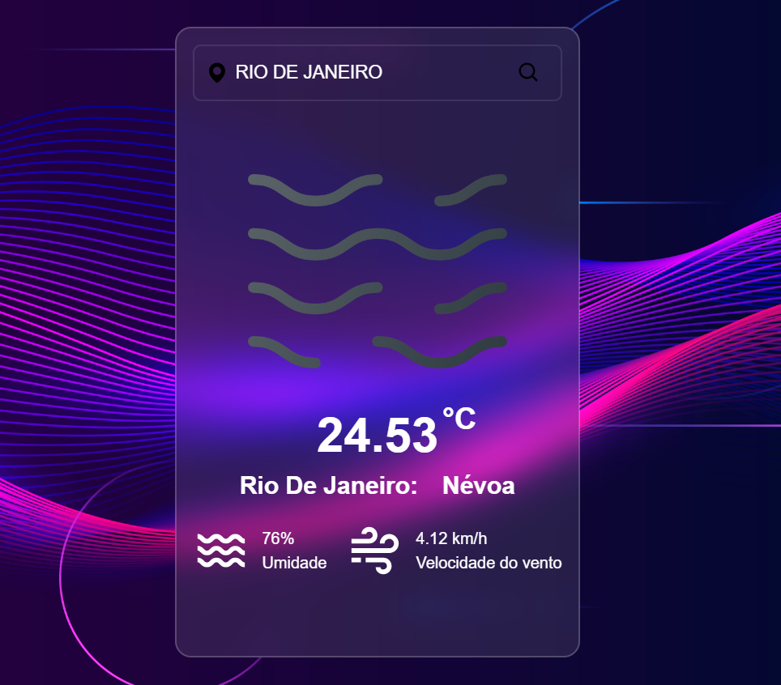

<!-- PROJECT SHIELDS -->

<!-- PROJECT LOGO -->
 

  

<h3 align="center">App Clima</h3>

  

    Aplicação/site que retorna o clima da cidade pesquisada
     
    <a href="https://isaac-yuri.github.io/app-clima/">Acessar aplicação</a>
    ·
    <a href="https://github.com/Isaac-Yuri/app-clima/issues/new?labels=bug&template=bug-report---.md">Reportar Bug</a>
  

<!-- TABLE OF CONTENTS -->

  
índice

  <ol>
    <li>
      <a href="#about-the-project">Sobre o projeto</a>
      <ul>
        <li><a href="#built-with">Tecnologias usadas</a></li>
      </ul>
    </li>
    <li><a href="#contributing">Contribuição</a></li>
    <li><a href="#license">Licença</a></li>
    <li><a href="#contact">Contato</a></li>
  </ol>

<!-- ABOUT THE PROJECT -->

## 💻 Sobre o projeto

Este projeto é uma aplicação de clima desenvolvido utilizando a API <a href="https://openweathermap.org/">OpenWeatherMap</a>. O objetivo principal da aplicação é fornecer a informação meteorológica da cidade que o usuário pesquisar de maneira simples e intuitiva.

(<a href="#readme-top">Voltar ao topo</a>)

### 🛠️ Tecnologias usadas

* [![React][React.js]][React-url]
* [![Typescript][Typescript]][Typescript-url]
* [![Tailwind][Tailwindcss]][Tailwind-url]

(<a href="#readme-top">Voltar ao topo</a>)

<!-- CONTRIBUTING -->

## 🤝 Contribuição

Se você tiver uma sugestão que possa melhorar este projeto, por favor, faça um fork do repositório e crie um pull request. Você também pode simplesmente abrir uma issue com a tag "enhancement" (melhoria). Não se esqueça de dar uma estrela ao projeto! Muito obrigado!

1. Faça um fork do Projeto
2. Crie sua Branch de Funcionalidade (`git checkout -b feature/AmazingFeature`)
3. Commit suas Alterações (`git commit -m 'Add some AmazingFeature'`)
4. Faça o Push para a Branch (`git push origin feature/AmazingFeature`)
5. Abra um Pull Request

(<a href="#readme-top">Voltar ao topo</a>)

<!-- LICENSE -->

## 📝 Licença

Esse projeto está sob licença. Veja o arquivo <a href="LICENSE">LICENÇA</a> para mais detalhes.

(<a href="#readme-top">Voltar ao topo</a>)

<!-- CONTACT -->

## 📬 Contato

Isaac Yuri  - isaacyuri22@gmail.com

Link do Projeto: [https://github.com/Isaac-Yuri/app-clima](https://github.com/Isaac-Yuri/app-clima)

(<a href="#readme-top">Voltar ao topo</a>)

<!-- MARKDOWN LINKS & IMAGES -->

[React.js]: https://img.shields.io/badge/React-20232A?style=for-the-badge&logo=react&logoColor=61DAFB
[React-url]: https://reactjs.org/
[Typescript]: https://shields.io/badge/TypeScript-3178C6?logo=TypeScript&logoColor=FFF&style=for-the-badge
[Typescript-url]: https://www.typescriptlang.org/
[Tailwindcss]: https://img.shields.io/badge/tailwindcss-%2338B2AC.svg?style=for-the-badge&logo=tailwind-css&logoColor=white
[Tailwind-url]: https://tailwindcss.com/
